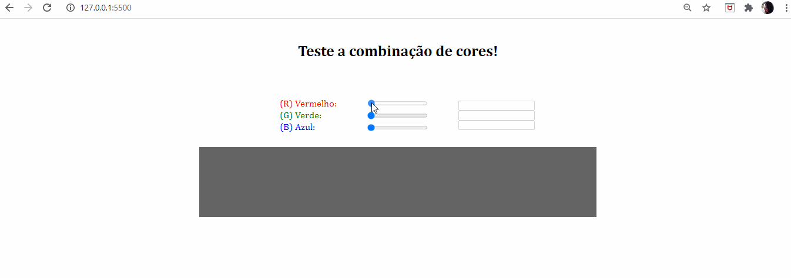

# Trabalho Prático - Módulo 1 - Bootcamp Full Stack da IGTI

## Objetivos

Exercitar os seguintes conceitos trabalhados no Módulo:

- [x] Utilização de elementos HTML
- [x] Utilização de CSS
- [x] Utilização de identificadores em elementos HTML
- [x] Captura de referência de elementos com JavaScript
- [x] Manipulação de eventos com JavaScript
- [x] Utilização de funções com JavaScript e CSS
- [x] Manipulação direta de CSS com JavaScript

## Enunciado

O enunciado solicitava construir, utilizando HTML, CSS e JavaScript puro, uma aplicação para a
visualização de cores a partir da escala RGB.

## Atividades

No qual teríamos que desempenhar as seguintes atividades:

1 - Implementar, através de HTML, CSS e JavaScript puro, uma aplicação que
contenha três inputs do tipo “range”, cujos valores vão de 0 a 255 e representem,
respectivamente, R (Red – Vermelho), G (Green – Verde) e B (Blue – Azul). 

2 - Essa combinação de valores deve ser utilizada para preencher a cor de fundo de
uma 
 quadrada. 

3 - Além disso, inclua três inputs de texto somente-leitura (desabilitados) para a
visualização do valor atual de cada input do tipo range. 

4 - À medida em que o usuário modifica o valor dos ranges com as teclas ← e → do
teclado, a 
 deve refletir a cor correspondente. 
  
5 - A imagem abaixo ilustra uma possível interface para a aplicação solicitada.

## Questionário

Após desenvolver o trabalho prático, teríamos que responder a um questionário.

## Resultado final

Segue amostra do resultado final após ter concluído o trabalho prático.

